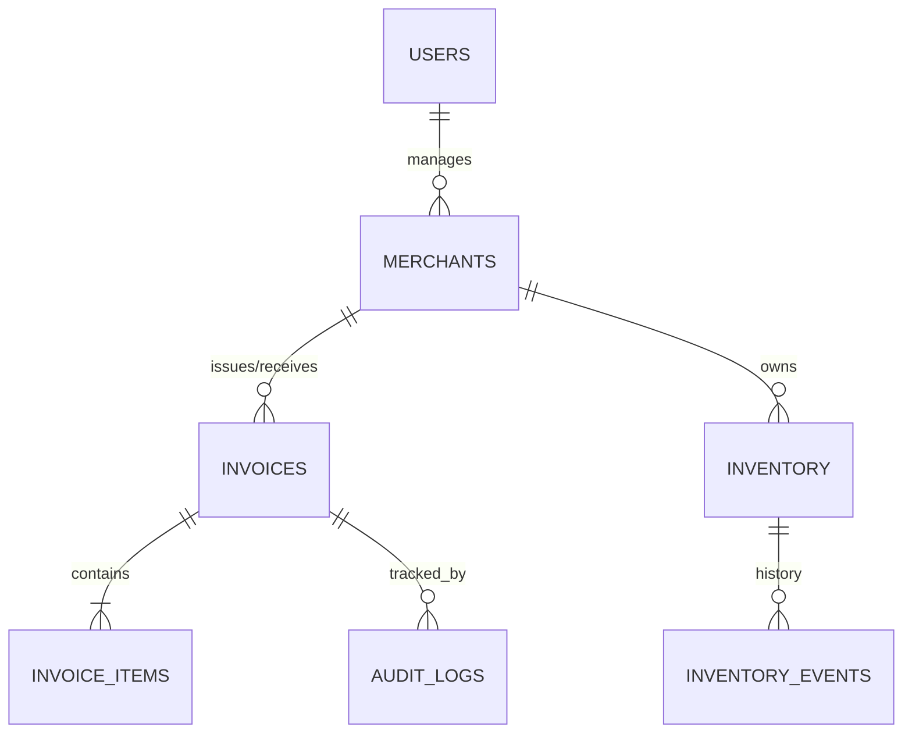

# InvoChain Technical Design & Specification

## A. System Architecture

### High-Level Architecture
The system follows a **Microservices Architecture** to ensure scalability, modularity, and independent deployment. Services communicate via REST APIs for synchronous operations and an Event Bus (RabbitMQ/Redis) for asynchronous workflows.

### Microservice Boundaries
1.  **Auth Service**: Handles user authentication (JWT), role management (Buyer, Seller, Admin), and session control.
2.  **Merchant Registry Service**: Manages merchant profiles, GSTIN verification, KYC details, and onboarding.
3.  **Invoice Service**: Core engine for generating GST-compliant invoices, validation, and state management.
4.  **Inventory Service**: Manages stock levels, reservations, and atomic updates based on invoice events.
5.  **Notification Service**: Listens to events and sends alerts (Email/SMS/In-App) to users.
6.  **Audit & Blockchain Service**: distinct service for immutable logging of all critical actions (Invoice creation, status changes, inventory updates).
7.  **API Gateway**: Single entry point for all client requests, handling routing, rate limiting, and auth verification.

### Event Flows
-   **Invoice Creation**: Seller -> API Gateway -> Invoice Service (Create) -> Event Bus (INVOICE_CREATED) -> Notification Service (Notify Buyer) & Inventory Service (Reserve Stock).
-   **Invoice Action (Accept)**: Buyer -> API Gateway -> Invoice Service (Update Status) -> Event Bus (INVOICE_ACCEPTED) -> Inventory Service (Commit Stock) & Audit Service (Log).
-   **Invoice Action (Reject)**: Buyer -> API Gateway -> Invoice Service (Update Status) -> Event Bus (INVOICE_REJECTED) -> Inventory Service (Release Stock).

---

## B. Database Schema (PostgreSQL)

### ER Diagram (Text Representation)


### SQL Schema

```sql
-- 1. Merchants (Registry)
CREATE TABLE merchants (
    id UUID PRIMARY KEY DEFAULT gen_random_uuid(),
    user_id UUID REFERENCES users(id), -- Admin user for this merchant
    gstin VARCHAR(15) UNIQUE NOT NULL,
    legal_name VARCHAR(255) NOT NULL,
    trade_name VARCHAR(255),
    address TEXT NOT NULL,
    city VARCHAR(100),
    state_code VARCHAR(2), -- GST State Code (e.g., '27' for Maharashtra)
    pincode VARCHAR(6),
    phone VARCHAR(15),
    email VARCHAR(255),
    kyc_status VARCHAR(20) DEFAULT 'PENDING', -- VERIFIED, REJECTED
    is_unregistered BOOLEAN DEFAULT FALSE, -- For Grace Mode
    created_at TIMESTAMP WITH TIME ZONE DEFAULT CURRENT_TIMESTAMP
);

-- 2. Inventory
CREATE TABLE inventory (
    id UUID PRIMARY KEY DEFAULT gen_random_uuid(),
    merchant_id UUID REFERENCES merchants(id),
    sku VARCHAR(50) NOT NULL,
    name VARCHAR(255) NOT NULL,
    hsn_code VARCHAR(10),
    unit VARCHAR(20), -- pcs, kg, ltr
    quantity DECIMAL(15, 2) DEFAULT 0, -- Available physical stock
    reserved_quantity DECIMAL(15, 2) DEFAULT 0, -- Locked for pending invoices
    unit_price DECIMAL(15, 2),
    created_at TIMESTAMP WITH TIME ZONE DEFAULT CURRENT_TIMESTAMP,
    updated_at TIMESTAMP WITH TIME ZONE DEFAULT CURRENT_TIMESTAMP,
    UNIQUE(merchant_id, sku)
);

-- 3. Inventory Events (Audit Trail for Stock)
CREATE TABLE inventory_events (
    id UUID PRIMARY KEY DEFAULT gen_random_uuid(),
    inventory_id UUID REFERENCES inventory(id),
    merchant_id UUID REFERENCES merchants(id),
    invoice_id UUID, -- Nullable if manual adjustment
    event_type VARCHAR(20) NOT NULL, -- 'RESERVE', 'RELEASE', 'COMMIT', 'ADJUSTMENT'
    quantity_change DECIMAL(15, 2) NOT NULL,
    previous_quantity DECIMAL(15, 2) NOT NULL,
    new_quantity DECIMAL(15, 2) NOT NULL,
    created_at TIMESTAMP WITH TIME ZONE DEFAULT CURRENT_TIMESTAMP
);

-- 4. Invoices (Enhanced)
CREATE TABLE invoices (
    id UUID PRIMARY KEY DEFAULT gen_random_uuid(),
    invoice_number VARCHAR(50) NOT NULL,
    seller_merchant_id UUID REFERENCES merchants(id),
    buyer_merchant_id UUID REFERENCES merchants(id), -- Can be null if unregistered
    buyer_gstin VARCHAR(15), -- Captured even if merchant record doesn't exist yet
    invoice_date DATE NOT NULL,
    due_date DATE,
    invoice_type VARCHAR(20) DEFAULT 'B2B', -- B2B, B2C, EXPORT
    place_of_supply VARCHAR(2), -- State Code
    
    -- Amounts
    total_taxable_value DECIMAL(15, 2) DEFAULT 0,
    total_cgst DECIMAL(15, 2) DEFAULT 0,
    total_sgst DECIMAL(15, 2) DEFAULT 0,
    total_igst DECIMAL(15, 2) DEFAULT 0,
    total_cess DECIMAL(15, 2) DEFAULT 0,
    total_amount DECIMAL(15, 2) NOT NULL,
    
    status VARCHAR(20) DEFAULT 'ISSUED', -- ISSUED, ACCEPTED, REJECTED, EDIT_REQUESTED
    compliance_status VARCHAR(20) DEFAULT 'PENDING', -- PENDING, VERIFIED
    
    file_url TEXT,
    created_at TIMESTAMP WITH TIME ZONE DEFAULT CURRENT_TIMESTAMP,
    updated_at TIMESTAMP WITH TIME ZONE DEFAULT CURRENT_TIMESTAMP,
    UNIQUE(seller_merchant_id, invoice_number)
);

-- 5. Invoice Items
CREATE TABLE invoice_items (
    id UUID PRIMARY KEY DEFAULT gen_random_uuid(),
    invoice_id UUID REFERENCES invoices(id),
    sku VARCHAR(50), -- Link to inventory
    description TEXT NOT NULL,
    hsn_code VARCHAR(10),
    quantity DECIMAL(10, 2) NOT NULL,
    unit_price DECIMAL(15, 2) NOT NULL,
    discount DECIMAL(15, 2) DEFAULT 0,
    
    taxable_value DECIMAL(15, 2) NOT NULL,
    gst_rate DECIMAL(5, 2) NOT NULL, -- 5, 12, 18, 28
    cgst_amount DECIMAL(15, 2) DEFAULT 0,
    sgst_amount DECIMAL(15, 2) DEFAULT 0,
    igst_amount DECIMAL(15, 2) DEFAULT 0,
    cess_amount DECIMAL(15, 2) DEFAULT 0,
    
    total_item_amount DECIMAL(15, 2) NOT NULL
);

-- 6. Audit Logs (Blockchain Anchored)
CREATE TABLE audit_logs (
    id UUID PRIMARY KEY DEFAULT gen_random_uuid(),
    entity_type VARCHAR(50) NOT NULL, -- 'INVOICE', 'INVENTORY', 'MERCHANT'
    entity_id UUID NOT NULL,
    action VARCHAR(50) NOT NULL, -- 'CREATED', 'STATUS_CHANGE', 'EDITED'
    actor_id UUID, -- User who performed action
    payload JSONB, -- Snapshot of data
    prev_hash VARCHAR(66),
    current_hash VARCHAR(66) NOT NULL,
    created_at TIMESTAMP WITH TIME ZONE DEFAULT CURRENT_TIMESTAMP
);
```

---

## C. API Specification (OpenAPI Style)

### 1. Invoice Service

**POST /api/v1/invoices**
-   **Summary**: Create a new B2B invoice.
-   **Body**:
    ```json
    {
      "seller_merchant_id": "uuid",
      "buyer_gstin": "27ABCDE1234F1Z5",
      "invoice_number": "INV-2024-001",
      "date": "2024-11-25",
      "items": [
        {
          "sku": "SKU-001",
          "quantity": 10,
          "unit_price": 500,
          "gst_rate": 18
        }
      ]
    }
    ```
-   **Response**: `201 Created` with Invoice ID.

**POST /api/v1/invoices/{id}/action**
-   **Summary**: Buyer accepts or rejects invoice.
-   **Body**:
    ```json
    {
      "action": "ACCEPT", // or REJECT, REQUEST_EDIT
      "reason": "Optional reason for rejection/edit"
    }
    ```

### 2. Merchant Registry

**POST /api/v1/merchants/onboard**
-   **Summary**: Register a new merchant.
-   **Body**: `{ "gstin": "...", "legal_name": "...", "address": "..." }`

**GET /api/v1/merchants/lookup/{gstin}**
-   **Summary**: Public lookup for GSTIN. Returns merchant details if registered, else returns basic GSTIN info (mocked/external).

### 3. Inventory Service

**GET /api/v1/inventory/{merchant_id}**
-   **Summary**: List all stock.

**POST /api/v1/inventory/adjust**
-   **Summary**: Manual stock adjustment (e.g., new stock arrival).
-   **Body**: `{ "sku": "SKU-001", "quantity_change": 100, "type": "ADD" }`

---

## D. Event Models and Queues

The system uses an Event Bus. Services publish events that others subscribe to.

1.  **`INVOICE_CREATED`**
    -   **Payload**: `{ "invoice_id": "...", "seller_id": "...", "buyer_gstin": "...", "items": [...] }`
    -   **Subscribers**:
        -   `NotificationService`: Emails buyer.
        -   `InventoryService`: **RESERVES** stock for the seller.
        -   `AuditService`: Logs creation.

2.  **`INVOICE_ACCEPTED`**
    -   **Payload**: `{ "invoice_id": "...", "buyer_id": "..." }`
    -   **Subscribers**:
        -   `InventoryService`: **COMMITS** stock (decrements `reserved`, decrements `quantity` for seller; increments for buyer if registered).
        -   `NotificationService`: Emails seller.

3.  **`INVOICE_REJECTED`**
    -   **Payload**: `{ "invoice_id": "...", "reason": "..." }`
    -   **Subscribers**:
        -   `InventoryService`: **RELEASES** stock (decrements `reserved` for seller).

---

## E. Inventory Engine Logic

### Stock Reservation (On Invoice Creation)
1.  Check if `quantity - reserved_quantity >= requested_quantity` for all items.
2.  If yes:
    -   `reserved_quantity += requested_quantity`
    -   Log `INVENTORY_EVENT` (Type: RESERVE).
3.  If no:
    -   Fail invoice creation (or create as "Backorder" if allowed).

### Stock Commit (On Invoice Accept)
1.  `quantity -= requested_quantity`
2.  `reserved_quantity -= requested_quantity`
3.  Log `INVENTORY_EVENT` (Type: COMMIT).
4.  (Optional) If buyer is a merchant on the platform, `buyer.quantity += requested_quantity`.

### Stock Release (On Invoice Reject)
1.  `reserved_quantity -= requested_quantity`
2.  Log `INVENTORY_EVENT` (Type: RELEASE).

---

## F. Audit Log / Blockchain Layer

### Data Structure
Each audit entry is cryptographically linked to the previous one to form a chain.

```json
{
  "id": "uuid",
  "timestamp": "2024-11-25T12:00:00Z",
  "action": "INVOICE_CREATED",
  "data_hash": "sha256(payload)",
  "prev_hash": "hash_of_previous_log_entry",
  "current_hash": "sha256(timestamp + action + data_hash + prev_hash)"
}
```

### Tamper Proofing
-   The `current_hash` depends on `prev_hash`. Changing an old record invalidates the chain.
-   Periodically, the latest `current_hash` can be anchored to a public blockchain (Ethereum/Polygon) as a "Checkpoint".

---

## G. User Experience Flow

### Scenario: Seller Sells to Buyer

1.  **Seller** logs in, goes to "Create Invoice".
2.  **Seller** enters Buyer GSTIN.
    -   *System*: Checks Registry.
    -   *Found*: Auto-fills name/address.
    -   *Not Found*: Prompts Seller to enter details manually (Grace Mode).
3.  **Seller** adds items (SKUs auto-complete from Inventory).
4.  **Seller** clicks "Issue Invoice".
    -   *System*: Validates stock -> Reserves Stock -> Generates Invoice -> Sends Email to Buyer.
5.  **Buyer** receives Email with link.
6.  **Buyer** views Invoice (no login required for view, but required for action).
7.  **Buyer** clicks "Accept".
    -   *System*: Updates Invoice Status -> Commits Inventory -> Generates Accounting Entry.
8.  **Seller** sees status "ACCEPTED" on dashboard.

---

## H. Sample Data

### Merchant
```json
{
  "legal_name": "TechSol Pvt Ltd",
  "gstin": "27AAAAA0000A1Z5",
  "address": "123 Tech Park, Pune, MH",
  "inventory": [
    { "sku": "LAPTOP-DELL", "quantity": 50, "reserved": 0 }
  ]
}
```

### Invoice Payload
```json
{
  "invoice_number": "INV-101",
  "seller_gstin": "27AAAAA0000A1Z5",
  "buyer_gstin": "29BBBBB1111B1Z6",
  "items": [
    { "sku": "LAPTOP-DELL", "qty": 2, "price": 50000 }
  ],
  "tax": { "cgst": 9000, "sgst": 9000 },
  "total": 118000
}
```
